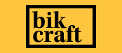
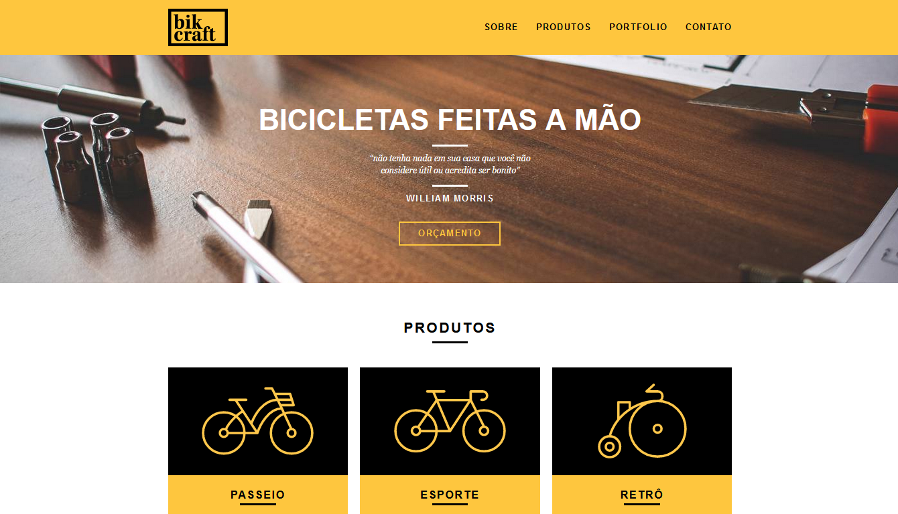

<h1 align="center">
  
</h1>

  <a href="#-technologies">Technologies</a>&nbsp;&nbsp;&nbsp;|&nbsp;&nbsp;&nbsp;
  <a href="#-project">Project</a>&nbsp;&nbsp;&nbsp;|&nbsp;&nbsp;&nbsp;
  <a href="#memo-licence">Licence</a>

 

  

 

  

## 🚀 Technologies

This project was developed with the following technologies:

- HTML
- CSS
- JavaScript
- PHP
- MVC Architecture

## 💻 Project

This project is the website of a fictitious company selling custom bicycles.

## :memo: Licence

This project is under the MIT license. See the archive [LICENSE](.github/LICENSE.md) for more details.
